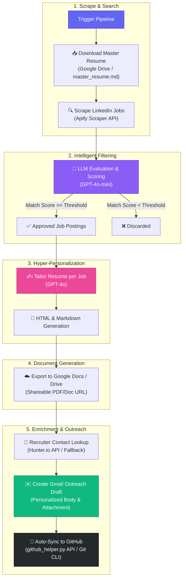

# AI Job Application Agent — Python Port

A direct Python translation of the n8n workflow diagram: it scrapes job
postings, filters them with an LLM, tailors your resume per job, generates a
shareable Google Doc/PDF, finds a recruiter contact, and drafts an outreach
email in Gmail.

## 🔄 End-to-End Autonomous Workflow Diagram



## 🖥️ Web Command Center Dashboard UI Features


The project includes an interactive, high-performance web dashboard served at `http://localhost:8000`:

```bash
# Launch the Web Command Center Dashboard
python server.py
```

### Key UI Features:
- 🎨 **Glassmorphism Dark-Mode Interface**: Premium control dashboard with smooth micro-animations, color-coded status pills, and responsive layout.
- 🎛️ **Live Search Configuration Bar**: Easily adjust job search query (`Machine Learning Engineer`, etc.), location/work mode (`Remote`), max jobs limit, and minimum LLM match score threshold (e.g. `60%`).
- 📊 **Real-Time Live Metrics Cards**: Instant counters tracking:
  - 🔍 **Jobs Scraped** (via Apify LinkedIn Scraper)
  - 🎯 **Filtered & Matched Jobs** (GPT-4o-mini evaluation)
  - 📄 **Tailored Resumes Created** (HTML & Markdown)
  - ✉️ **Outreach Drafts** (Personalized outreach to recruiter contacts)
- ⚡ **Interactive Pipeline Visualizer**: Live stepper showing real-time state for all 5 stages of the autonomous application pipeline.
- 📑 **Tabbed Command Center Views**:
  - **Jobs Grid**: Displays match score badges, company tags, job summaries, and one-click preview buttons for tailored HTML resumes.
  - **Outreach Email Drafts**: View recipient recruiter email, subject line, body text, with quick-action buttons (`Copy Subject`, `Copy Body`, `Launch Mail App`).
  - **Live Execution Logs**: Stream of agent events and network responses.
- 🚀 **One-Click Browser Actions**:
  - **🚀 Run AI Job Pipeline**: Triggers full autonomous scraping, tailoring, and drafting directly from the browser UI.
  - **🐙 Sync to GitHub**: One-click manual backup of all generated HTML resumes, cover letters, and `drafts.json` to GitHub (`github_helper.py`).

## File-to-node mapping


| n8n node(s) | Python function | File |
|---|---|---|
| Execute workflow → Google Drive: Download resume | `download_master_resume()` | `main.py` |
| HTTP Request (Apify LinkedIn Jobs Scraper) | `scrape_linkedin_jobs()` | `main.py` |
| Manage a Model (GPT-4o-mini) → Filter | `filter_jobs()` | `main.py` |
| Manage a Model (GPT-4o) | `tailor_resume()` | `main.py` |
| Markdown (MD → HTML) | `markdown_resume_to_html()` | `main.py` |
| Convert to document → Share file | `create_tailored_resume_doc()` | `main.py` + `google_drive_helper.py` |
| HTTP Request / HTTP Request1 (Hunter.io) | `find_recruiter_email()` | `main.py` |
| Edit1 → Create draft (Gmail) | `draft_outreach_email()` | `main.py` + `gmail_helper.py` |

## Setup

1. Install dependencies:
   ```bash
   pip install -r requirements.txt
   ```

2. Google Cloud:
   - Enable the **Drive API**, **Docs API**, and **Gmail API**.
   - Create an OAuth 2.0 **Desktop app** client ID, download it as
     `credentials.json` in this folder.
   - First run opens a browser for consent; `token.json` and
     `gmail_token.json` are cached afterward.

3. Environment variables (put these in a `.env` file and load with
   `python-dotenv`, or export them in your shell):
   ```bash
   OPENAI_API_KEY=sk-...
   APIFY_API_TOKEN=apify_api_...
   APIFY_LINKEDIN_ACTOR=apify/linkedin-jobs-scraper
   HUNTER_API_KEY=...
   RESUME_DOC_ID=<google-doc-id-of-your-master-resume>
   DRIVE_FOLDER_ID=<folder-id-to-store-tailored-resumes>
   JOB_SEARCH_QUERY="Machine Learning Engineer"
   JOB_SEARCH_LOCATION=Remote
   MAX_JOBS=10
   MIN_MATCH_SCORE=60
   SENDER_NAME="Your Name"
   ```

4. Run it:
   ```bash
   python main.py
   ```

## Notes / things to adapt

- `scrape_linkedin_jobs()` assumes an Apify actor that accepts
  `title`/`location`/`rows` input and returns a list of job objects with
  `title`, `company`, `description`, and ideally `company_domain`. Swap in
  the exact input schema for whichever Apify LinkedIn scraper actor you use.
- `filter_jobs()` and `tailor_resume()` call the OpenAI API directly. If you
  were using GPT-4o/4o-mini through a different provider (Azure OpenAI,
  OpenRouter, etc.), only the `client` initialization in `main.py` needs to
  change.
- Error handling is intentionally simple (log-and-skip) — for production use,
  add retries with backoff around the network calls (Apify, OpenAI, Hunter,
  Google APIs all can rate-limit or transiently fail).
- `find_recruiter_email()` uses Hunter.io's domain search; if your n8n
  workflow used a different enrichment source, swap the request in that one
  function.
